# PR4

## Завдання 4.1
### Для цього завдання напишемо код, який буде намагатися викликати виділення максимальної к-сті пам'яті відповідно до розрядності, яку ми вручну виставляємо всередині нашого докера
```
#include <stdio.h>
#include <stdlib.h>
#include <stdint.h>

int main() {
    printf("SIZE_MAX: %lu байт (%.2f EB)\n", (unsigned long)SIZE_MAX, SIZE_MAX / (1024.0*1024*1024*1024*1024*1024));

    void* p = malloc(SIZE_MAX);
    if (p == NULL) {
        perror("malloc не вдалося");
    } else {
        printf("malloc успішно\n");
        free(p);
    }
    return 0;
}
```

### Спробуємо скомпілювати його на 64 та 32 розрядній архітектурі:
### x86_64:
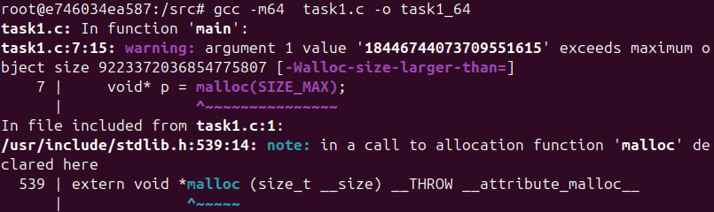 
### x86:
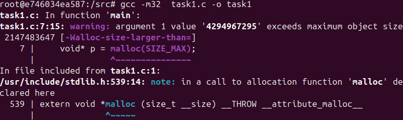
### Як ми бачимо, ми отримуємо помилки через те, що пам'ять, яку ми намагаємося виділити не може бути надана, так, як ми виходимо за рамки розміру об'єкту (~8 EB для 64-х розрядної та ~2 GB для 32-х розрядної системи)
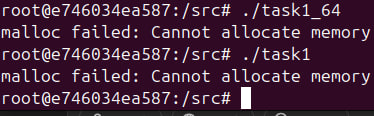
### Це стається через те, що ми не можемо вийти за межі значення PTRDIFF_MAX зі типу даних ptrdiff_t. Цей тип даних використовується як тип результату при відніманні двох показників. І займає стільки ж, скільки size_t, проте він Є ЗНАКОВИМ.
### Це означає, що реально ми можемо використовувати не 2^(64) -1, а лише 2^(63) - 1. Звідси і рамки об'єкту, менші в 2 рази за ті, які ми захотіли отримати при виділенні.
### Отже, навіть якщо ми і можемо в теорії викликати виділення на таку к-сть пам'яті, то по-перше, тут її немає фізично, а по-друге, ми упремося у встановлене обмеження

## Завдання 4.2
### Тут ми перевіряємо, що саме відбудеться, коли ми в malloc спробуємо задати від'ємне число байтів на виділення. Для цього напишемо простеньку програму з введенням двох цілочисельних даних, які потім перемножаться:
```
#include <stdio.h>
#include <stdlib.h>
#include <stdint.h>

int enter_int(){
    int x;
    char c;

    while(1){
        printf("Enter int num: ");
        if(scanf("%d", &x) == 1){
            // cleaning buffer
            while((c = getchar()) != '\n' && c != EOF);
            return x;
        } else {
            printf("Input error. Try again\n");
            // cleaning buffer
            while((c = getchar()) != '\n' && c != EOF);
        }
    }
}

int main() {
    int num1 = enter_int();
    int num2 = enter_int();

    int sum = num1 * num2;
    printf("num1 * num2 = %d\n",sum);
    printf("Calling malloc(%d)...\n", sum);

    void* p = malloc(sum);
    if (p == NULL) {
        perror("malloc error\n");
    } else {
        printf("malloc success\nfree space");
        free(p);
    }
    return 0;
}
```

### За допомогою докера та компіляції в звичайному 64-бітному та 32-бітному режимі зробимо кілька тестів:
### 64-bit:
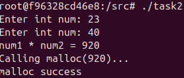
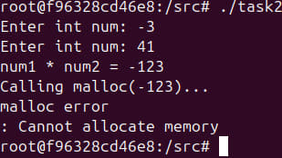

### 32-bit:
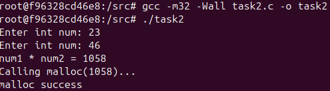
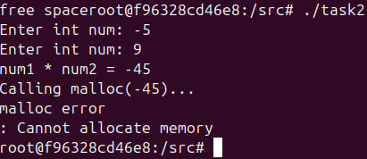

### Висновки. Чому ми отримуємо помилки при намаганні ввести від'ємну к-сть байтів на виділення в пам'яті?
### Проблема в тому, що malloc використовує цілочисельний беззнаковий тип size_t, а коли ми намагаємося додати в нього знак, то відбувається арифметика по модулю (тобто, ми додаємо до максимально можливого значення (16 ексабайт) наше від'мне число) і, відповідно, виходимо за межі PTRDIFF_MAX.

## Завдання 4.3
### Для виконання цього завдання зробимо просту програму, яка буде викликати malloc(0), та робити перевірки щодо адреси, яку він поверне:

```
#include <stdio.h>
#include <stdlib.h>

int main(int argc, char const *argv[])
{
    void *p = malloc(0); // allocate 0 bytes of memory

    if(p == NULL){
        printf("malloc(0) returned NULL\n");
    }else{
        printf("malloc(0) returned pointer %p\n", p);
        free(p);
        printf("free(p) is done\n");
    }
    return 0;
}
```

### Переглянемо результати запуску звичайного виконавчаого файлу:
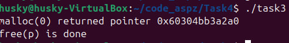
### Та за допомогою команди ltrace:
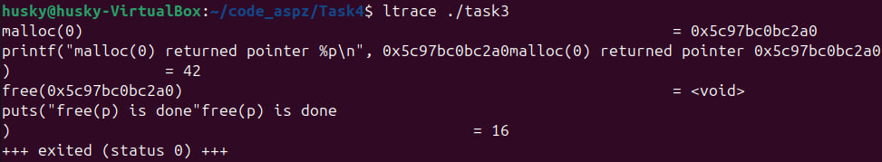

### Що ми бачимо і як ми це можемо пояснити?
### Спостерігаємо, що при виклику ьalloc(0), він повернув конкретну адресу. Зазвичай у таких випадках можна очікувати два варіанти розвитку подій - повернення NULL або випадкової адреси, яку не можливо розіменувати (звернутися до неї). Як ми бачимо, отримали ми саме 2 варіант. До речі, команда ltrace доволі прикольна

## Завдання 4.4
### Так, безумовно, у настпному коді є помилки:
```
void *ptr = NULL;
while (<some-condition-is-true>) {
    if (!ptr) // if pointer has no address
        ptr = malloc(n);
    [... <використання 'ptr'> ...]
    free(ptr);
}
```

### Основна проблема в тому, що в кінці циклу while, пойнтеру не присвоюється значення NULL і він далі вказує на пусту комірку очищеної пам'яті. Для коректної роботи треба в кінці коду дописати:
```
ptr = NULL;
```

### Напишемо коректну програму та подивимося, що ж ми отримаємо при компіляції коду:
```
#include <stdio.h>
#include <stdlib.h>

int main(){

    void *ptr = NULL;

    for (int i = 0; i < 10; i++) {
        if (!ptr){ // if pointer has no address
            ptr = malloc(i);
            printf("Allocated %d bytes of memory\n", i);
        }

        free(ptr);
        ptr = NULL;
    }

return 0;
}
```
### При компіляції ми отримаємо наступне:
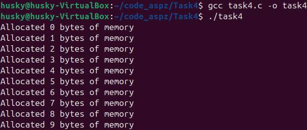
### А у випадку, якщо закоментуємо ptr = NULL; , то отримаємо помилку на моменті, коли постараємося звільнити вже звільнену комірку пам'яті та отримаємо помилку "double free".
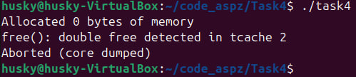

## Завдання 4.5
### realloc дозволяє нам змінювати розмір виділеної для нас пам'яті. Проте, є випадки, коли ми, через деякі причини, не можемо виділити певну к-сть пам'яті за допомогою realloc. У такому випадку він повертає NULL
### До речі, якраз на такий випадок не варто писати таким чином, адже ми можемо втратити шлях до комірки і буде витік пам'яті! (Краще використовувати пойнтер - посередник)
```
ptr = realloc(ptr, new_super_size); 
```
### Краще так:
```
temp = realloc(ptr, new_super_size); 
if (temp != NULL)
    ptr = temp;
...
```

### А тепер напишемо програму і розглянемо всі можливі випадки у процесі виклику realloc():
```
#include <stdio.h>
#include <stdlib.h>

int main(int argc, char const *argv[])
{
    void *ptr = malloc(sizeof(size_t)); // allocating memory
    
    if(!ptr){
        perror("malloc failed");
        return 1;
    }

    printf("Memory allocate successful!\n");

    size_t ultra_monster_huge_size = (size_t) - 1;
    void *tmp = realloc(ptr, ultra_monster_huge_size);

    if(tmp == NULL){
        perror("realloc failed");
        free(ptr);
    }else{
        printf("realloc succeed!");
        free(ptr);
    }
    
    return 0;
}
```
### Якщо викличемо це зараз, то отримуємо наступне:
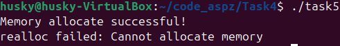
### Помилка стається через перевиділення величезного розміру в пам'яті, який не здатен виділитися чисто фізично
### А тепер, якщо поставити адекватну кількість пам'яті для її перевиділення:
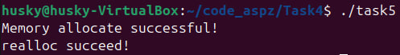

## Завдання 4.6
### Якщо ми запускаємо realloc із першим аргументом NULL і певним розміром в другому аргументів, то це буде працювати аналогічно, якби ми виділили пам'ять через malloc (Це навіть прописано в стандартах С)
```
void *p = realloc(NULL, 100);
```
### А от у випадку, коли наш другий аргумент (розмір перевизначеної пам'яті) буде 0, то це буде означати, що ми звільнимо цю комірку пам'яті (аналогічно до команди free)
```
void *p = realloc(p, 0); // == free (p)
```

### Напишемо програму, яка це все ілюструє:
```
#include <stdio.h>
#include <stdlib.h>

int main(int argc, char const *argv[])
{
    void *ptr = malloc(sizeof(long));
    if(ptr == NULL){
        perror("malloc error");
        return 1;
    }

    printf("Memory successfuly allocated for ptr!\n");

    void *a = realloc(ptr, 0);
    if(a == NULL){
        printf("ptr was successfuly freed!\n"); // for now, a is NULL and prt is freed !
    }

    a = realloc(NULL, sizeof(long));
    if(a != NULL){
        printf("Memory was successfuly allocated for a!\n"); // for now a is allocated
        free(a);
    }

    return 0;
}
```

### Поглянемо на результат:
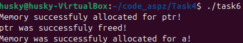

## Завдання 4.7
### Отже, треба було переписати заданий код за допомогою reallocarray(). Що ж, зробимо:
```
#define _GNU_SOURCE
#include <stdlib.h>

#include <stdio.h>

struct sbar{
    int x;
    double y;
};


int main(int argc, char const *argv[])
{
    struct sbar *ptr, *newptr;
    ptr = calloc(1000, sizeof(struct sbar)); 
    // calling to allocate 1000 elements size of struct sbar
    // but it`s safe due to check on overflow
    if(!ptr){
        perror("calloc error");
        return 1;
    }

    newptr = reallocarray(ptr, 500, sizeof(struct sbar));
    if(!newptr) {
        perror("reallocarray error");
       free(ptr);
       return 1;
    }

    // newptr = realloc(ptr, 500 * sizeof(struct sbar));
    // if(!newptr){
    //    perror("realloc error");
    //    free(ptr);
    //    return 1;
    //}

    ptr = newptr;
    ptr[0].x = 10;
    ptr[0].y = 1.5;

    printf("Success!\nptr[0] = {%d, %.1f}\n", ptr[0].x, ptr[0].y);

    free(ptr);
    return 0;
}
```

### Давайте подивимося результати з використанням ltrace:
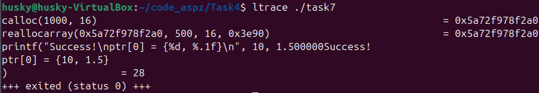
### А тепер, зробимо так, як планувалося з самого початку:
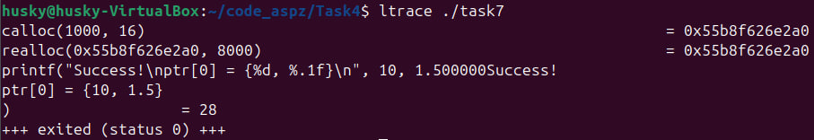
### Як ми бачмо, програма в обох випадках виконалася без помилок, проте ми застосували reallocarray тому, що він набагато безпечніший за звичайний realloc за рахунок перевірок на переповнення максимального розміру об'єкта. У такому випадку reallocarray повертає NULL.

## Завдання 4.8 (12 варіант)
### Що ж краще calloc чи malloc + memset? Давайте визначимо.
### Отже, malloc безпечно з перевіркою на переповнення виділяє пам'ять та заповнює її 0. У такому випадку, навіть якщо ми так само будемо використовувати memset для заповнення виділеної пам'яті з malloc, то перевірки на переповнення всеодно немає, що однозначно показує, що calloc набагато простіший та безпечніший.
### Проте, створимо програму та перевіримо обидва випадки:
```
#include <stdio.h>
#include <stdlib.h>
#include <string.h>

int main(int argc, char const *argv[])
{
    size_t count = 10;
    size_t size = sizeof(int);

    // -- calloc --
    int *a = calloc(count, size);
    if(!a){
        perror("calloc error");
        return 1;
    }

    // -- calloc check --
    printf("calloc check:\n");
    for(int i = 0; i < count; i++){
        printf("[%d]: %d\n", i, a[i]);
    }
    free(a);
    printf("calloc is successfuly freed!\n");
    
    // -- memset + malloc --
    int *b = malloc(count * size);
    if(!b){
        perror("malloc error");
        return 1;
    }
    memset(b, 0, count * size);

    // -- memset + realloc check--
    printf("memset + malloc check:\n");
    for(int i = 0; i < count; i++){
        printf("[%d]: %d\n", i, b[i]);
    }
    free(b);
    printf("memset + malloc are successfuly freed!\n");
    return 0;
}
```

### Поглянемо результати:
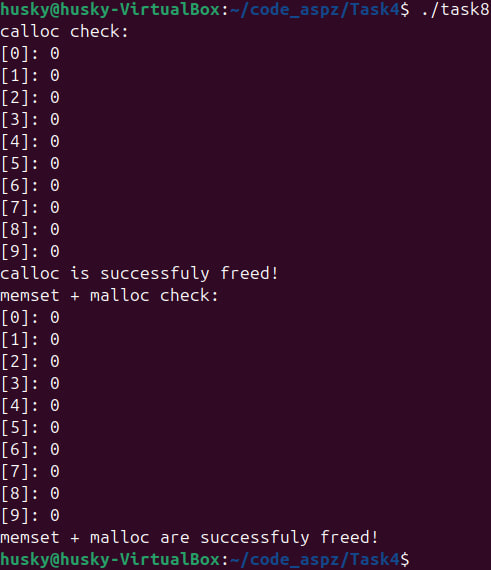

### Також, поглянемо за допомогою команди ltrace
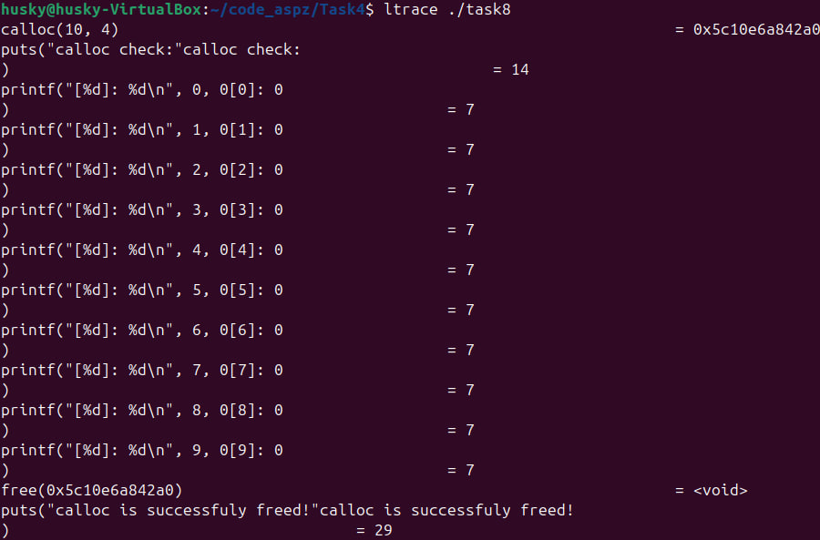
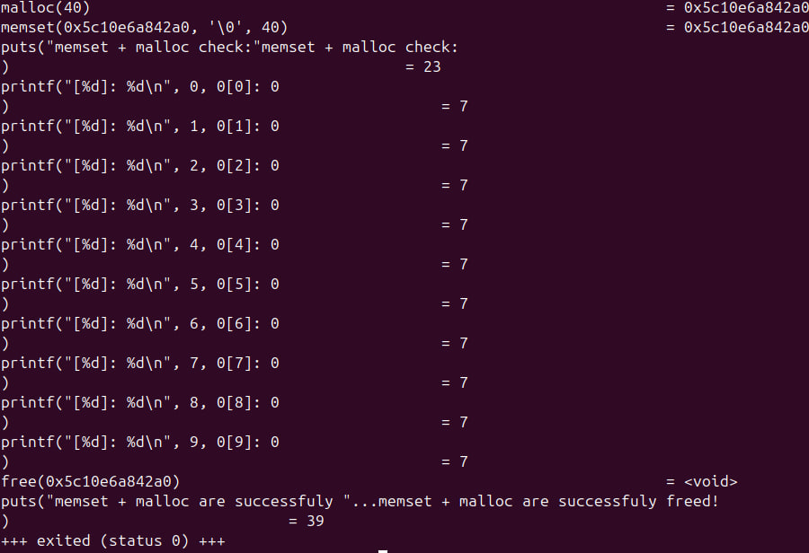

### Як ми бачимо все виконується успішно.